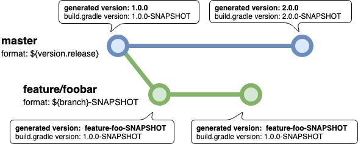

# Gradle Git Versioning Plugin 
[](https://plugins.gradle.org/plugin/me.qoomon.git-versioning)
[](CHANGELOG.md)
[](https://github.com/qoomon/gradle-git-versioning-plugin/actions)
[](https://lgtm.com/projects/g/qoomon/gradle-git-versioning-plugin)



**ℹ Also available as [Maven Extension](https://github.com/qoomon/maven-git-versioning-extension)**

This plugin can virtually set project version and properties, based on current **Git status**.

ℹ **No files will be modified, version and properties are modified in memory only.**

* Get rid of...
    * editing `build.gradle`
    * managing project versions within files and Git tags
    * git merge conflicts

## Usage

### Add Plugin to Gradle Project

⚠️ You should apply git versioning (`gitVersioning.apply{...}`) directly after `version` declaration at root project only.

#### Groovy DSL `build.gradle`

```groovy
plugins {
    id 'me.qoomon.git-versioning' version '5.2.0'
}

version = '0.0.0-SNAPSHOT'
gitVersioning.apply {
    // see configuration documentation below
}
```

#### Kotlin DSL `build.gradle.kts`

```kotlin
plugins {
    id("me.qoomon.git-versioning") version "6.2.0"
}


// ...

version = "0.0.0-SNAPSHOT"
gitVersioning.apply {
    // see configuration documentation below
}
```

## Configure Plugin

ℹ Consider [CI/CD](#cicd-setup) section when running this plugin in a CI/CD environment

You can configure the version and properties adjustments for specific branches and tags.

**Groovy DSL Example:** `build.gradle`

```groovy
version = '0.0.0-SNAPSHOT'
gitVersioning.apply {
    refs {
        branch('.+') {
            version = '${ref}-SNAPSHOT'
        }
        tag('v(?<version>.*)') {
            version = '${ref.version}'
        }
    }

    // optional fallback configuration in case of no matching ref configuration
    rev {
        version = '${commit}'
    }
}
```

**Kotlin DSL Example:** `build.gradle.kts`

```kotlin
version = "0.0.0-SNAPSHOT"
gitVersioning.apply {
    refs {
        branch(".+") {
            version = "\${ref}-SNAPSHOT"
        }
        tag("v(?<version>.*)") {
            version = "\${ref.version}"
        }
    }

    // optional fallback configuration in case of no matching ref configuration
    rev {
        version = "\${commit}"
    }
}
```

### Configuration Options

- `disable` global disable(`true`)/enable(`false`) extension, default is `false`.
    - Can be overridden by command option, see (Parameters & Environment Variables)[#parameters-&-environment-variables]

- `describeTagPattern` An arbitrary regex to match tag names for git describe command (has to be a **full match pattern** e.g. `v.+`), default is `.*`
- `updateGradleProperties` Enable(`true`)/disable(`false`) version and properties update in `gradle.properties` file, default is `false`
    - Can be overridden by command option, see (Parameters & Environment Variables)[#parameters-&-environment-variables]

- `refs` List of ref configurations, ordered by priority.
    - ℹ First matching configuration will be used.
      <br><br>

    - `considerTagsOnBranches` By default, tags pointing at current commit will be ignored if HEAD is attached to a branch.
      - If this option is `true` tags will always be taken into account.
        <br><br>

    - `branch(pattern)`/`tag(pattern)` specific ref patch definition.
      - `pattern` An arbitrary regex to match ref names
        - has to be a **full match pattern** e.g. `main` or `feature/.+`
          <br><br>

      - `describeTagPattern` An arbitrary regex to match tag names for git describe command
        - has to be a **full match pattern** e.g. `v.+`)
        - will override global `describeTagPattern` value
          <br><br>

      - `version` The new version format, see [Format Placeholders](#format-placeholders)
      - `properties` A property definitions to update the value of a property. 
        - `name` The property name 
        - `value` The new value format of the property, see [Format Placeholders](#format-placeholders)
          <br><br>
          **groovy**
          ```groovy
          properties = [
            "name" : "value",
          ]
          ```
          ⚠️  `groovy.lang.MetaClass` hides `properties` config field. 
          <br> 
          If you need to call a method on `properties` config field, you need to use the alias field `properties_` e.g.
          `properties_.put("name", "value")`
          <br><br>
          **kotlin**
          ```kotlin
          properties = mapOf(
            "name" to "value",
          )            
          ```
        <br>

      - `updateGradleProperties` Enable(`true`) or disable(`false`) version and properties update in `gradle.properties` file
        - will override global `updateGradleProperties` value

- `rev` Rev configuration will be used if no ref configuration is matching current git situation.
    - same as `branch(pattern)`/`tag(pattern)` configuration, except `pattern` parameter.

### Format Placeholders

ℹ `….slug` placeholders means all `/` characters will be replaced by `-`.

ℹ Final `version` will be slugified automatically, so no need to use `${….slug}` placeholders in `version` format.

ℹ define placeholder default value (placeholder is not defined) like this `${name:-DEFAULT_VALUE}`<br>
e.g `${env.BUILD_NUMBER:-0}` or `${env.BUILD_NUMBER:-local}`

ℹ define placeholder overwrite value (placeholder is defined) like this `${name:+OVERWRITE_VALUE}`<br>
e.g `${dirty:-SNAPSHOT}` resolves to `-SNAPSHOT` instead of `-DIRTY`

###### Placeholders

- `${env.VARIABLE}` Value of environment variable `VARIABLE`
- `${property.name}` Value of commandline property `-Pname=value`
  <br><br>

- `${version}` `version` set in `build.gradle` e.g. '1.0.0-SNAPSHOT'
  - `${version.core}` the core version component of `${version}` e.g. '1.2.3'
  - `${version.major}` the major version component of `${version}` e.g. '1'
    - `${version.major.next}` the `${version.major}` increased by 1 e.g. '2'
  - `${version.minor}` the minor version component of `${version}` e.g. '2'
    - `${version.minor.next}` the `${version.minor}` increased by 1 e.g. '3'
  - `${version.patch}` the patch version component of `${version}` e.g. '3'
    - `${version.patch.next}` the `${version.patch}` increased by 1 e.g. '4'
  - `${version.label}` the version label of `${version}` e.g. 'SNAPSHOT'
    - `${version.label.prefixed}` like `${version.label}` with label separator e.g. '-SNAPSHOT'
- Project Version Pattern Groups
  - Content of regex groups in `projectVersionPattern` can be addressed like this:
  - `${version.GROUP_NAME}`
  - `${version.GROUP_INDEX}`
  - Named Group Example

    **groovy**
      ```groovy
      projectVersionPattern = '^.+-(?<environment>.+)-SNAPSHOT$'
      branch('main') {
          version = '${version.environment}-SNAPSHOT'
      }
      ```
    **kotlin**
      ```kotlin
      projectVersionPattern = '^.+-(?<environment>.+)-SNAPSHOT\$'
      branch("main") {
          version = "\${version.environment}-SNAPSHOT"
      }
      ```
      <br> 

- `${ref}` `${ref.slug}` ref name (branch or tag name or commit hash)
- Ref Pattern Groups
    - Content of regex groups in branch/tag `pattern` can be addressed like this:
    - `${ref.GROUP_NAME}` `${ref.GROUP_NAME.slug}`
    - `${ref.GROUP_INDEX}` `${ref.GROUP_INDEX.slug}`
    - Named Group Example
      
        **groovy**
        ```groovy
        branch('feature/(?<feature>.+)') {
            version = '${ref.feature}-SNAPSHOT'
        }
        ```
        **kotlin**
        ```kotlin
        branch("feature/(?<feature>.+)") {
            version = "\${ref.feature}-SNAPSHOT"
        }
        ```
        <br>

- `${commit}` commit hash '0fc20459a8eceb2c4abb9bf0af45a6e8af17b94b'
- `${commit.short}` commit hash (7 characters) e.g. '0fc2045'
- `${commit.timestamp}` commit timestamp (epoch seconds) e.g. '1560694278'
- `${commit.timestamp.year}` commit year e.g. '2021'
- `${commit.timestamp.year.2digit}` 2-digit commit year.g. '21'
- `${commit.timestamp.month}` commit month of year e.g. '12'
- `${commit.timestamp.day}` commit day of month e.g. '23'
- `${commit.timestamp.hour}` commit hour of day (24h)e.g. '13'
- `${commit.timestamp.minute}` commit minute of hour e.g. '59'
- `${commit.timestamp.second}` commit second of minute e.g. '30'
- `${commit.timestamp.datetime}` commit timestamp formatted as `yyyyMMdd.HHmmss`e.g. '20190616.161442'
  <br><br>

- `${describe}` Will resolve to `git describe --tags --first-parent` output
- `${describe.distance}` The distance count to last matching tag
- `${describe.tag}` The matching tag of `git describe`
  - `${describe.tag.version}` the tag version determined by regex `\d+\.\d+\.\d+`
    - `${describe.tag.version.core}` the core version component of `${describe.tag.version}` e.g. '1.2.3'
    - `${describe.tag.version.major}` the major version component of `${describe.tag.version}` e.g. '1'
      - `${describe.tag.version.major.next}` the `${describe.tag.version.major}` increased by 1 e.g. '2'
      - `${describe.tag.version.major.nextPlusDistance}` the `${describe.tag.version.major}` increased by `${describe.distance}` + 1 e.g. '2'
    - `${describe.tag.version.minor}` the minor version component of `${describe.tag.version}` e.g. '2'
      - `${describe.tag.version.minor.next}` the `${describe.tag.version.minor}` increased by 1 e.g. '3'
      - `${describe.tag.version.minor.nextPlusDistance}` the `${describe.tag.version.minor}` increased by `${describe.distance}` + 1 e.g. '2'
    - `${describe.tag.version.patch}` the patch version component of `${describe.tag.version}` e.g. '3'
      - `${describe.tag.version.patch.next}` the `${describe.tag.version.patch}` increased by 1 e.g. '4'
      - `${describe.tag.version.patch.nextPlusDistance}` the `${describe.tag.version.patch}` increased by `${describe.distance}` + 1 e.g. '2'
    - `${describe.tag.version.label}` the label version component of `${describe.tag.version}` e.g. 'SNAPSHOT'
      - `${describe.tag.version.label.next}` the `${describe.tag.version.label}` converted to an integer and increased by 1 e.g. '6'
      - `${describe.tag.version.label.nextPlusDistance}` the `${describe.tag.version.label}` converted to an integer increased by `${describe.distance}` + 1 e.g. '9'
- Describe Tag Pattern Groups
  - Content of regex groups in `describeTagPattern` can be addressed like this:
  - `${describe.tag.GROUP_NAME}` `${describe.tag.GROUP_NAME.slug}`
  - `${describe.tag.GROUP_INDEX}` `${describe.tag.GROUP_INDEX.slug}`
  - Named Group Example

      **groovy**
      ```groovy
      branch('main') {
          describeTagPattern = 'v(?<version>.*)'
          version = '${ref.feature}-SNAPSHOT'
      }
      ```
      **kotlin**
      ```kotlin
      branch("main") {
          describeTagPattern = "v(?<version>.*)"
          version = "\${describe.tag.version}-SNAPSHOT"
      }
      ```
      <br> 

- `${dirty}` If repository has untracked files or uncommitted changes this placeholder will resolve to `-DIRTY`, otherwise it will resolve to an empty string.
    - ⚠️ Can lead to performance issue on very large projects (10,000+ files)
- `${dirty.snapshot}` Like `${dirty}`, but will resolve to `-SNAPSHOT`
  <br><br>

- `${value}` Original value of matching property (Only available within property format)


### Parameters & Environment Variables

- Disable Extension
    - **Environment Variables**
     - `export VERSIONING_DISABLE=true`
    - **Command Line Parameters**
     - `gradle … -Dversioning.disable`

- Provide **branch** or **tag** name
    - **Environment Variables**
     - `export VERSIONING_GIT_REF=$PROVIDED_REF` e.g. `refs/heads/main`, `refs/tags/v1.0.0` or `refs/pull/1000/head`
     - `export VERSIONING_GIT_BRANCH=$PROVIDED_BRANCH_NAME` e.g. `main` or `refs/heads/main`
     - `export VERSIONING_GIT_TAG=$PROVIDED_TAG_NAME` e.g. `v1.0.0` or `refs/tags/v1.0.0`
    - **Command Line Parameters**
     - `gradle … -Dgit.ref=$PROVIDED_REF`
     - `gradle … -Dgit.branch=$PROVIDED_BRANCH_NAME`
     - `gradle … -Dgit.tag=$PROVIDED_TAG_NAME`

  ℹ Especially useful for **CI builds** see [Miscellaneous Hints](#miscellaneous-hints)

- Update `gradle.properties` file
    - **Environment Variables**
     - `export VERSIONING_UPDATE_GRADLE_PROPERTIES=true`
    - **Command Line Parameters**
     - `gradle … -Dversioning.updateGradleProperties`

## Provided Project Properties

- `git.commit` e.g. '0fc20459a8eceb2c4abb9bf0af45a6e8af17b94b'
- `git.commit.short` e.g. '0fc2045'
- `git.commit.timestamp` e.g. '1560694278'
- `git.commit.timestamp.datetime` e.g. '2019-11-16T14:37:10Z'

- `git.ref` `git.ref.slug` HEAD ref name (branch or tag name or commit hash)

---

## Gradle Tasks

* `version`
    * Print project version e.g. `gradle :version -q`

## CI/CD Setup

Most CI/CD systems do checkouts in a detached HEAD state so no branch information is available, however they provide environment variables with this information. 
You can provide those, by using [Parameters & Environment Variables](#parameters--environment-variables).

### Native Support

* GitHub Actions: if `$GITHUB_ACTIONS == true`, `GITHUB_REF` is considered
* GitLab CI: if `$GITLAB_CI == true`, `CI_COMMIT_BRANCH` and `CI_COMMIT_TAG` are considered
* Circle CI: if `$CIRCLECI == true`, `CIRCLE_BRANCH` and `CIRCLE_TAG` are considered
* Jenkins: if `JENKINS_HOME` is set, `BRANCH_NAME` and `TAG_NAME` are considered

### Manual Setup

Set following environment variables before running your `gradle` command

```shell
export VERSIONING_GIT_REF=$PROVIDED_REF;
```

`$PROVIDED_REF` value examples: `refs/heads/main`, `refs/tags/v1.0.0` or `refs/pull/1000/head`

or

```shell
export VERSIONING_GIT_BRANCH=$PROVIDED_BRANCH;
export VERSIONING_GIT_TAG=$PROVIDED_TAG;
```

`$PROVIDED_BRANCH` value examples: `main`, `refs/heads/main` or `refs/pull/1000/head`

`$PROVIDED_TAG` value examples: `v1.0.0` or `refs/tags/v1.0.0`

---

## Miscellaneous Hints

### Commandline To Print Project Version

`gradle :version -q`

---

## Build & Release

```shell
  ./gradlew build
  # Publishes this plugin to local Maven
  ./gradlew publishToMavenLocal
  # Publishes this plugin to Gradle Plugin portal.
  ./gradlew login && ./gradlew publishPlugins
```
